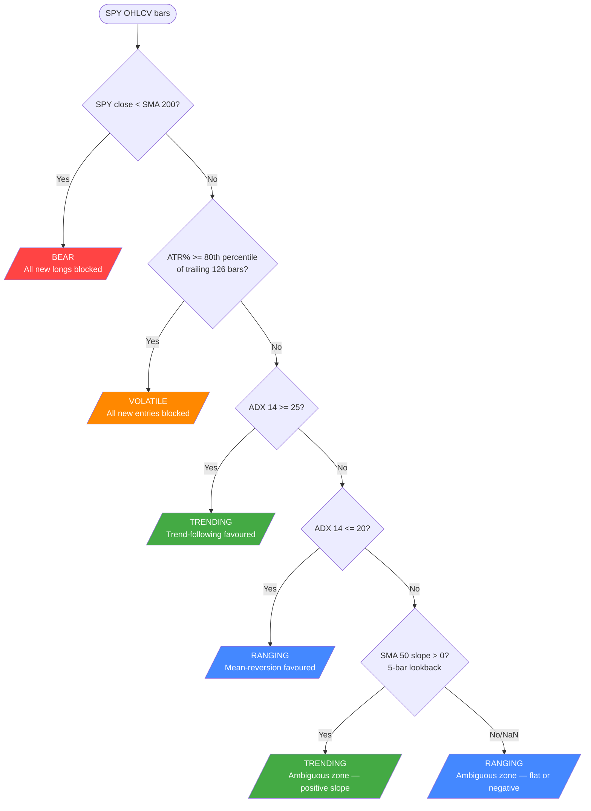
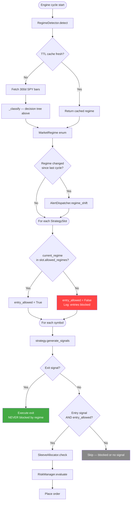
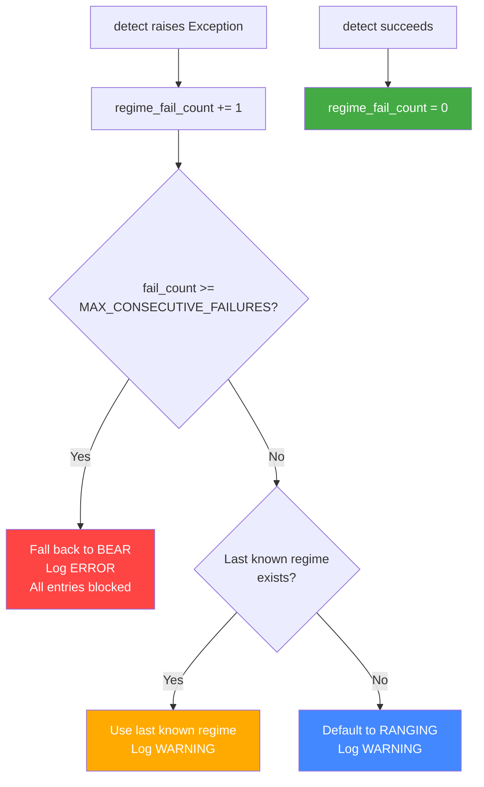

# Regime Detection — Architecture & Audit

## 1. Regime Classification (`regime/detector.py`)

The `RegimeDetector._classify()` method processes SPY daily bars through a
priority-ordered decision tree. The first matching condition wins.

**Defaults:** ADX trend = 25, ADX range = 20, volatility percentile = 80th,
volatility window = 126 bars, SMA slope lookback = 5 bars.

---

## 2. Engine Integration (`engine/trader.py`)

The engine calls `RegimeDetector.detect()` once per cycle, then gates each
strategy slot's new entries on the result.

**Key rule:** Exits are never blocked by regime. Only new entries are gated.

---

## 3. Detection Failure Path

When `detect()` raises an exception, the engine uses a graduated fallback:

**Default threshold:** 3 consecutive failures before BEAR lockdown
(`settings.REGIME_MAX_CONSECUTIVE_FAILURES`).

---

## 4. Regime Consumers

| Module | Uses Regime? | How |
|--------|:---:|-----|
| `regime/detector.py` | — | Computes regime from SPY data |
| `engine/trader.py` | Yes | Fetches once per cycle; gates entries per slot |
| `strategies/base.py` | Config only | `StrategySlot.allowed_regimes` declares permitted regimes |
| `risk/manager.py` | No | Independent risk gates applied downstream |
| `risk/allocator.py` | No | HWM drawdown gate independent of regime |

---

## 5. Current Slot Configuration

| Strategy | Allowed Regimes | Blocked By |
|----------|----------------|------------|
| SMA Crossover | TRENDING, RANGING | BEAR, VOLATILE |
| RSI Reversion | TRENDING, RANGING | BEAR, VOLATILE |
| Donchian Breakout | TRENDING | RANGING, BEAR, VOLATILE |

---

## 6. Audit Findings (2026-05-01)

| # | Issue | Severity | Status |
|---|-------|----------|--------|
| 1 | Detection failure bypassed all gating (`current_regime = None` skipped the gate) | High | **Fixed** — graduated fallback: last known → BEAR after N failures |
| 2 | ADX ambiguous zone (20–25) uses 5-bar SMA(50) slope — fragile to noise | Low | Documented. Acceptable for current risk profile. |
| 3 | Config strings uppercase (`"TRENDING"`) vs enum lowercase (`"trending"`) | Low | Documented. Not compared in code today. |
| 4 | Duplicate SPY fetching (RegimeDetector + SPYTrendFilter) | Low | Documented. Future optimization candidate. |
